# Crowdfunding ETL

# ETL Mini Project 

## Overview
This ETL mini project focuses on building an Extract, Transform, Load (ETL) pipeline using Python, Pandas, and either Python dictionary methods. The objective is to extract data from provided sources, transform it, create CSV files, design an Entity-Relationship Diagram (ERD) and a table schema, and finally load the CSV data into a Postgres database.

## Files
- ETL_Mini_Project_Ibandi_EMyhreHager.ipynb
- crowdfunding_db_schema.sql
- Resources
  - crowdfunding.xlsx
  - contacts.xlsx
- Output
  - category.csv
  - subcategory.csv
  - campaign.csv
  - contacts.csv

## Instructions
1. Clone the repository to your local machine.
2. Ensure you have the required dependencies installed, including Python, Pandas, and a Postgres database.
3. Execute the code in the Jupyter Notebook [ETL_Mini_Project_Ibandi_EMyhreHager.ipynb](https://github.com/indubt/Crowdfunding_ETL/blob/main/ETL_Mini_Project_Ibandi_EMhyreHager.ipynb) step by step to perform the ETL process.

    a. This Extracts data from the provided [crowdfunding.xlsx](https://github.com/indubt/Crowdfunding_ETL/blob/main/Resources/crowdfunding.xlsx) and [contacts.xlsx](https://github.com/indubt/Crowdfunding_ETL/blob/main/Resources/contacts.xlsx) files.

    b. Transforms the data according to specified requirements.

    c. Creates CSV files for Category, Subcategory, Campaign, and Contacts and writes them to the [Output](https://github.com/indubt/Crowdfunding_ETL/tree/main/Output) folder.

4. Based on the CSV files generated, designed an [ERD](https://github.com/indubt/Crowdfunding_ETL/blob/main/Screenshots/01.ERD.png) and a table schema for the Postgres database using the [QuickDBD](https://app.quickdatabasediagrams.com/#/) tool.

    ERD diagram shows that there are 4 tables (contacts, categories, subcategories and campaign). 

      a. Contacts has one-to-one relationship with campaign

      b. Categories has one-to-many relationship with campaign
      
      c. Subcategories has one-to-many relationship with campaign

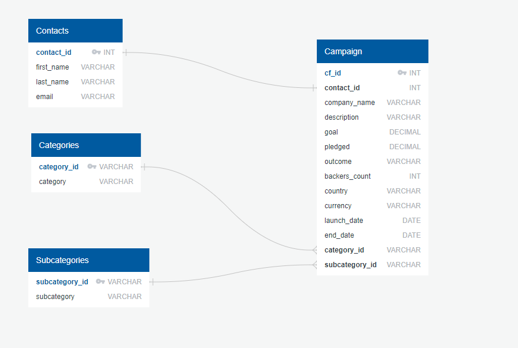

5. Create a new database in Postgres using PgAdmin.

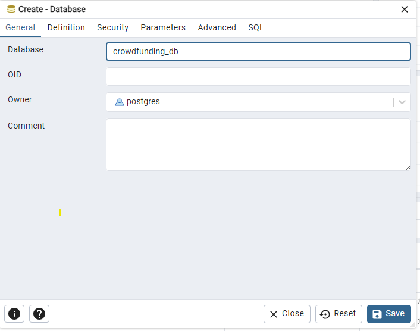

6. Screenshot below shows that there are no public tables in the database (Before Table Creation)

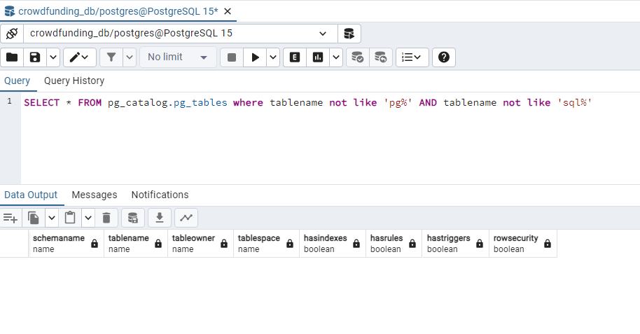

7. Execute the SQL commands in [crowdfunding_db_schema.sql](https://github.com/indubt/Crowdfunding_ETL/blob/main/crowdfunding_db_schema.sql) to create the necessary tables and constraints in your Postgres database.

Screenshot here shows the successful schema creation and the tables created in the public schema.

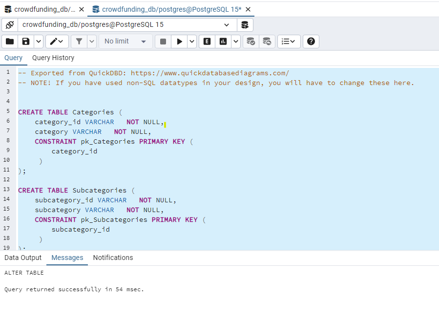

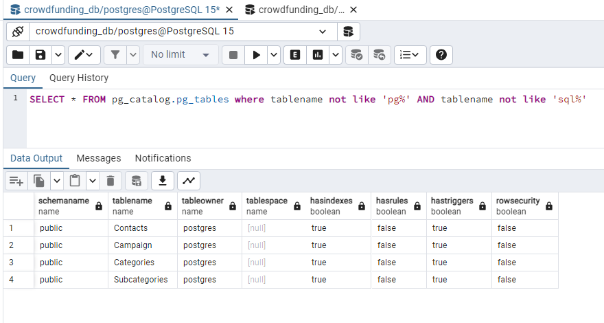

8. Verify the table creation by running a SELECT statement for each table and before data import.

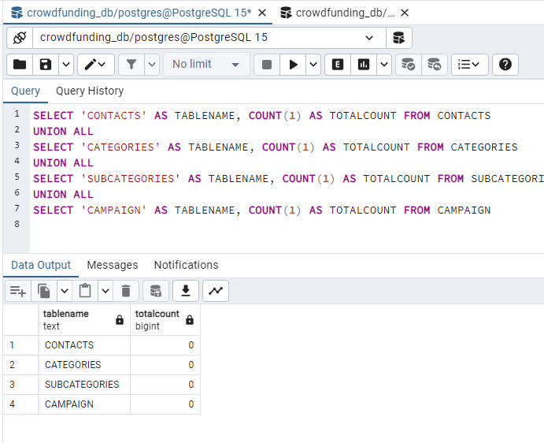

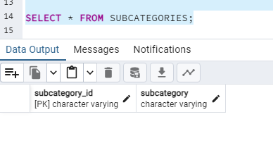

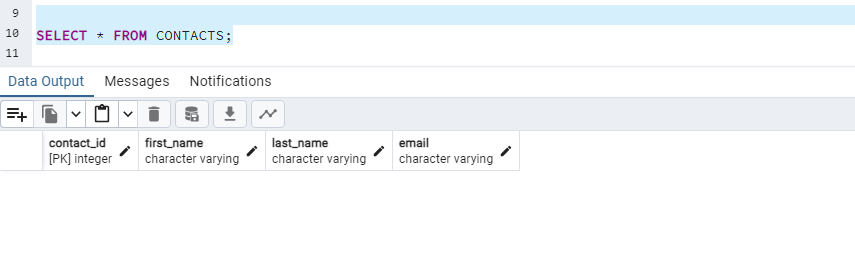

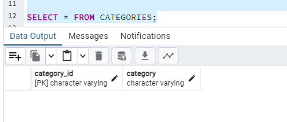

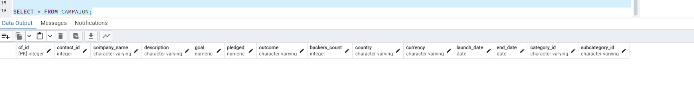

9. After the tables are created use the PgAdmin data import functionality to load the CSV files to the appropriate tables in the following order to avoid any foreign key constraint issues: Categories, Subcategories, Contacts, Campaign. (Campaign data has to be the last one imported)

Screenshots below shows the successful import of data from csv files

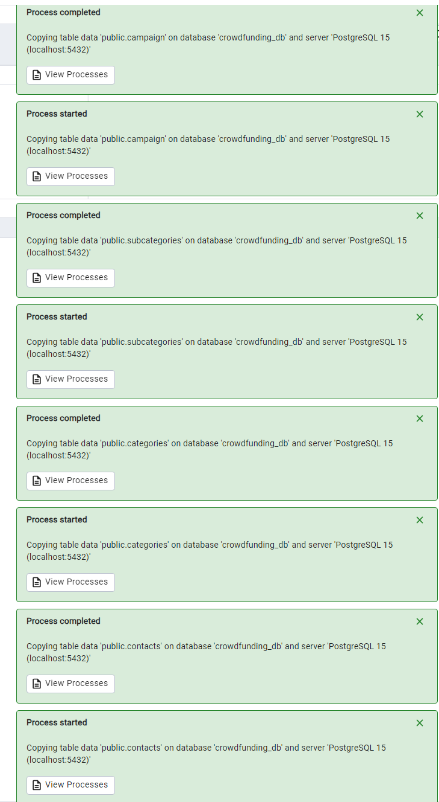

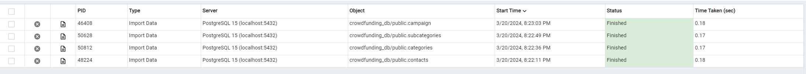

10. Verify that each table has the correct data by running a SELECT statement for each.

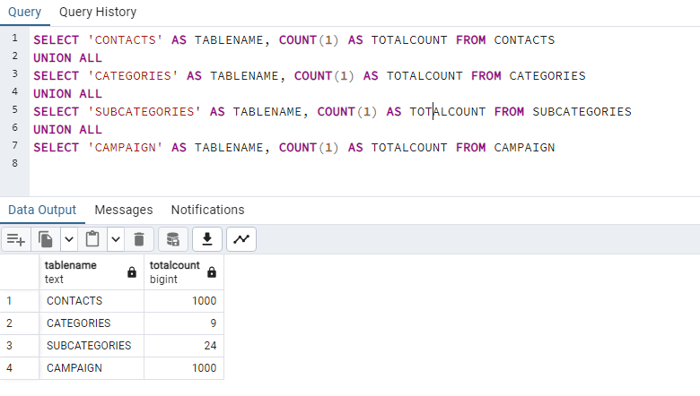

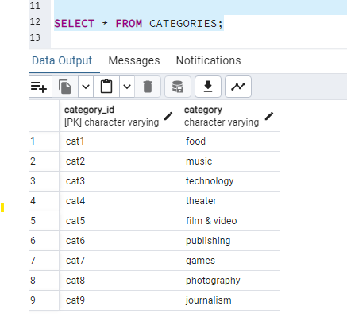

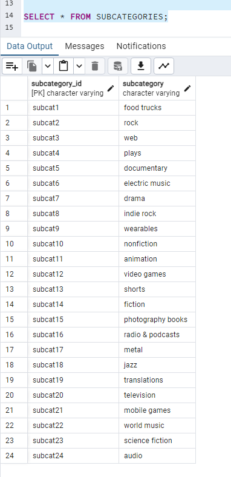

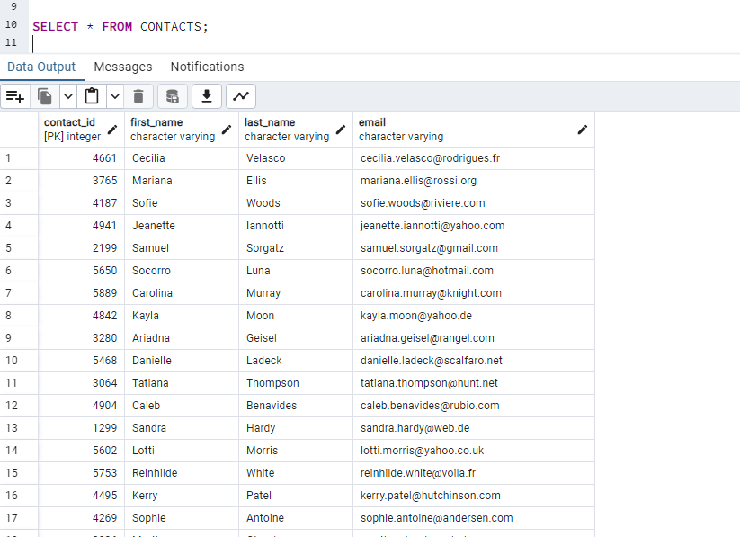

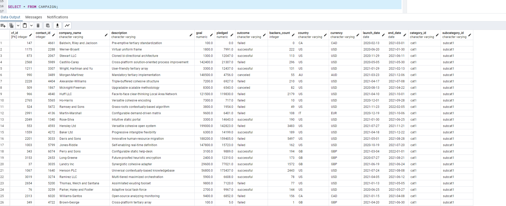

## Contributors
- Indu Bandi Tulasi: [GitHub Profile](https://github.com/indubt)
- Ezrelle Myhre-Hager: [GitHub Profile](https://github.com/myhre062)

## Reference
- Data for this dataset was generated by edX Boot Camps LLC, and is intended for educational purposes only.
